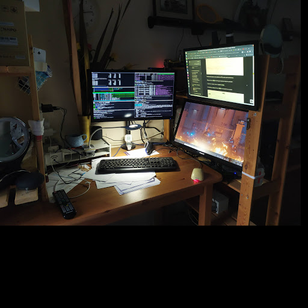

# **No Ads (like YouTube premium? without having to pi-hole). simple interface, low resource usage with persistent local playlist!**

This console app will launch multiple threads handling several functions

* detecting copy action of YouTube video URL (right click in YouTube pages for your favourite videos), and queue into a persistent playlist (recent in first play, or change as your like!)
* consuming items from the playlist and feed it into console based mpv player (so that no browser is used for playing YouTube programmes)
* automatically casting to different host (such as a RPI3/4) for remote(or third screen) playing (need to setup password-less ssh) if available, otherwise local playing
* more to come, including keypress action controls, but you can always control in mpv playing
* follow-me feature in a clustered home environment - share persisted playlist in your household. 

dependency packages and related commands - 

`pip install xsel, pyperclip`

`cat ~/.ssh/id_rsa.pub | ssh kt@192.168.0.15 "cat >> .ssh/authorized_keys`

`alias pl='export DISPLAY=:0;python3 /mnt/nfs/p1bb/packages/shared/playlist.py'`

